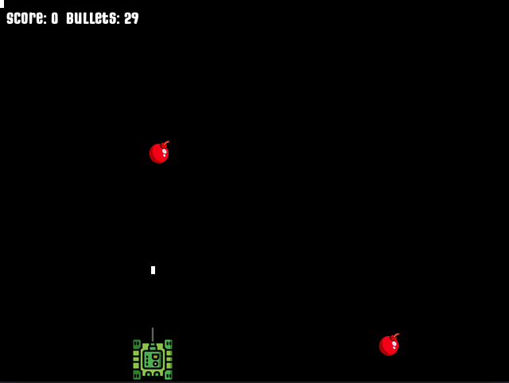

# Tank Game

## Overview

Tank Game is a top-down shooter game built using Golang and Ebitengine. The game allows player to control a tank and shot down bombs before they reach your territory.

## How to Play
- Move Left: Left Arrow Key
- Move Right: Right Arrow Key
- Shoot: Spacebar
- Pause Game: Escape

The goal is to shoot down bombs before they reach your territory. If a bomb passes your line it is game over, otherwise game will be finished and the results will be shown when the tank runs out of ammunition